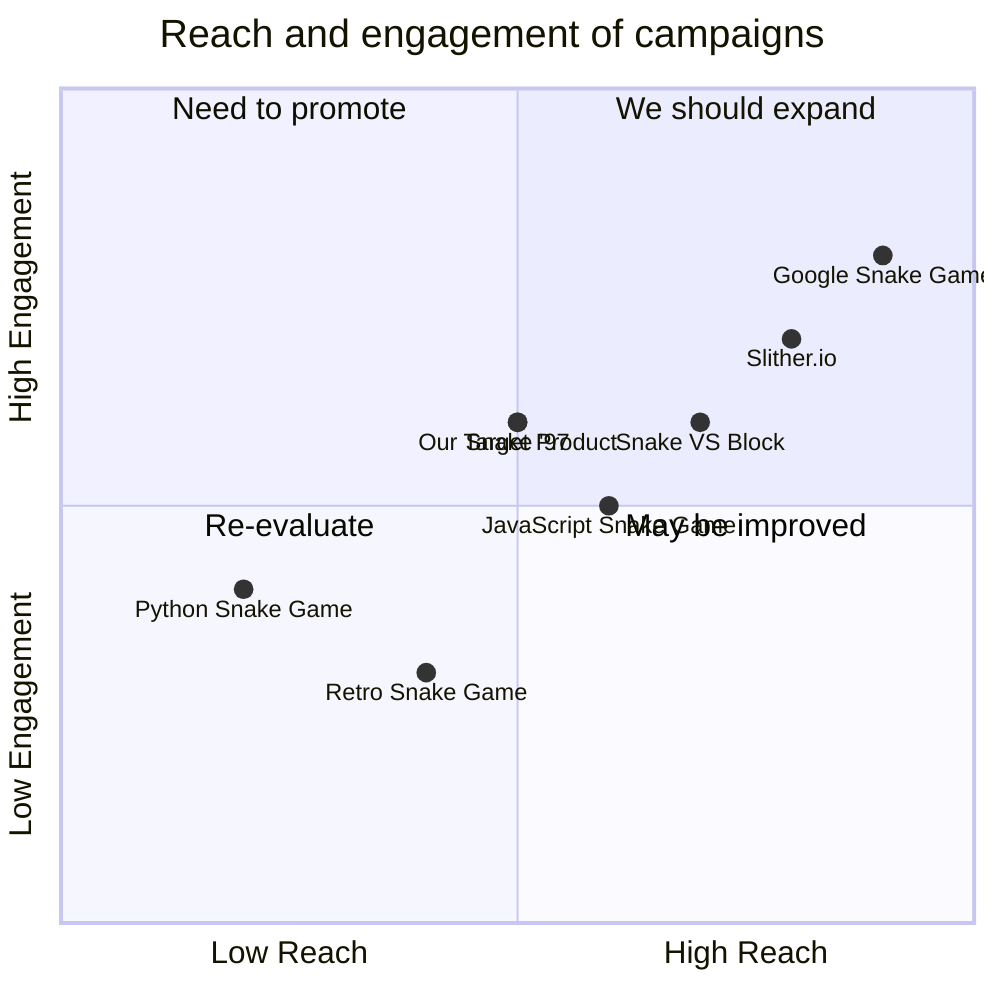

## Original Requirements
The boss has asked for the creation of a command-line interface (CLI) snake game.

## Product Goals
```python
[
    "Create a simple, fun and engaging CLI snake game",
    "Ensure the game is easy to navigate and user-friendly",
    "Implement a scoring system to track player progress"
]
```

## User Stories
```python
[
    "As a user, I want to be able to easily start a new game so that I can play whenever I want",
    "As a user, I want clear instructions on how to play the game so that I can understand the rules",
    "As a user, I want to be able to control the snake using my keyboard so that I can play the game",
    "As a user, I want the game to become progressively more difficult so that I am continuously challenged",
    "As a user, I want to see my score so that I can track my progress"
]
```

## Competitive Analysis
```python
[
    "Python Snake Game: A simple CLI snake game with basic functionality",
    "JavaScript Snake Game: A web-based snake game with a more visual interface",
    "Retro Snake Game: A mobile app that replicates the classic snake game on old mobile phones",
    "Slither.io: A multiplayer online game where players control a snake and try to grow by eating orbs",
    "Snake '97: A mobile app that replicates the classic snake game with a retro interface",
    "Snake VS Block: A mobile game that combines the snake game with a block-breaking mechanic",
    "Google Snake Game: A web-based snake game offered by Google as part of its doodle games"
]
```

## Competitive Quadrant Chart


## Requirement Analysis
The product should be a CLI snake game that is easy to navigate and user-friendly. It should include a scoring system to track player progress. The game should become progressively more difficult as the player's score increases.

## Requirement Pool
```python
[
    ("Implement a CLI for the game", "P0"),
    ("Create a snake that the player can control", "P0"),
    ("Implement a scoring system", "P0"),
    ("Increase game difficulty as the player's score increases", "P1"),
    ("Provide clear instructions on how to play the game", "P1")
]
```

## UI Design draft
The game will be based on a CLI, so the design will be text-based. The snake will be represented by a series of characters that move around the screen. The player's score will be displayed at the top of the screen. The game will have a simple, clean design to make it easy for the player to focus on the gameplay.

## Anything UNCLEAR
There are no unclear points.