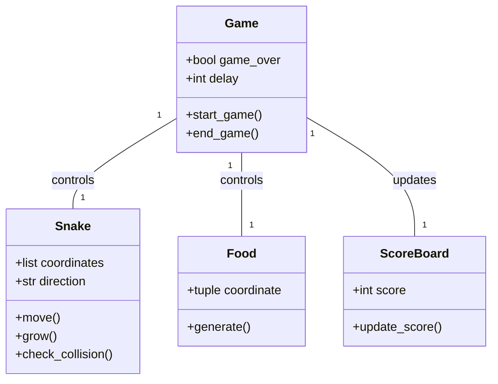
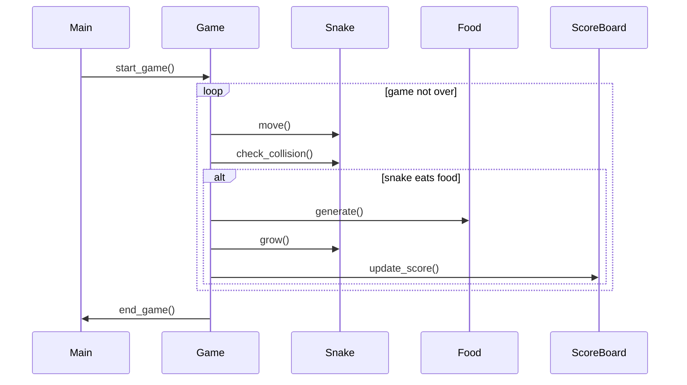

## Implementation approach
The game will be implemented using Python's built-in libraries such as curses for the CLI interface and random for the food generation. The game will have a main loop that will keep the game running until the player loses. The snake will be a list of coordinates that will move in a certain direction based on the player's input. The food will be a randomly generated coordinate that the snake can eat to increase its length. The score will be calculated based on the length of the snake. The difficulty will increase by decreasing the delay between each move of the snake as the score increases.

## Python package name
```python
"cli_snake_game"
```

## File list
```python
[
    "main.py",
    "game.py",
    "snake.py",
    "food.py",
    "scoreboard.py"
]
```

## Data structures and interface definitions


## Program call flow


## Anything UNCLEAR
The requirement is clear to me.